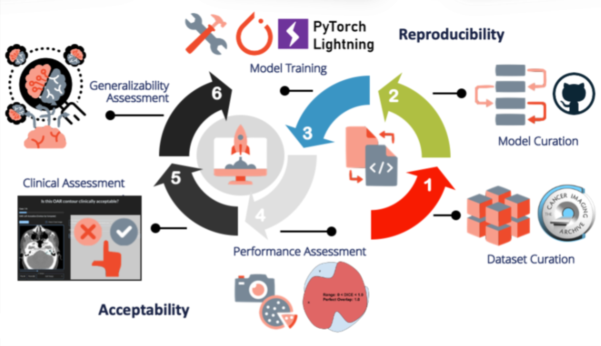

# SCARF
## auto-Segmentation Clinical Acceptability & Reproducibility Framework

### [Website](https://scarfai.ca)&nbsp;&nbsp;&nbsp;&nbsp;[Paper](https://www.medrxiv.org/content/10.1101/2022.01.15.22269276v2)&nbsp;&nbsp;&nbsp;&nbsp;[Inference Colab](https://colab.research.google.com/drive/1YjbnqRCKdaTnEg3xdKyo2bzSRpMNoQ8I?usp=sharing)


Official Github page for ["auto-Segmentation Clinical Acceptability & Reproducibility Framework"](https://www.medrxiv.org/content/10.1101/2022.01.15.22269276v2) currently on archive.



### Highlights:
- Our study highlights the significance of both quantitative and qualitative controls for benchmarking new auto-segmentation systems effectively, promoting a more robust evaluation process of AI tools.
- We address the lack of baseline models for medical image segmentation benchmarking by presenting SCARF, a comprehensive and reproducible six-stage framework, which serves as a valuable resource for advancing auto-segmentation research and contributing to the foundation of AI tools in radiation therapy planning.
- SCARF enables benchmarking of 11 open-source convolutional neural networks (CNN) against 19 essential organs-at-risk (OARs) for radiation therapy in head and neck cancer, fostering transparency and facilitating external validation.
- To accurately assess the performance of auto-segmentation models, we introduce a clinical assessment toolkit based on the open-source QUANNOTATE platform, further promoting the use of external validation tools and expert assessment.
- Our study emphasises the importance of clinical acceptability testing and advocates its integration into developing validated AI tools for radiation therapy planning and beyond, bridging the gap between AI research and clinical practice.

## Getting Started

To run inference using the trained models follow the instruction found here:<br>

[](https://colab.research.google.com/drive/1YjbnqRCKdaTnEg3xdKyo2bzSRpMNoQ8I?usp=sharing)

To train the models:

- Clone repo and initialize Conda environment

```shell
git clone https://github.com/bhklab/SCARF.git
conda env create -f environment.yml
```

- Put your nifti/nrrd images in the format described in "configs/example_config.json"
- Run train.sh script

```shell
chmod +x train.sh
./train.sh
```

## Citation

If you find our work or any of our materials useful, please cite our paper:

```
...
```