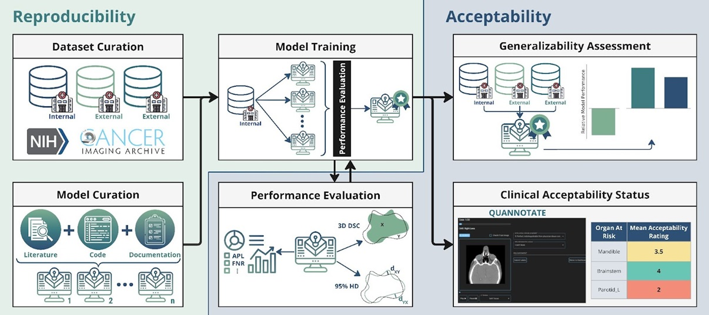

# SCARF
## auto-Segmentation Clinical Acceptability & Reproducibility Framework

### [Website](https://scarfai.ca)&nbsp;&nbsp;&nbsp;&nbsp;[Paper](https://www.medrxiv.org/content/10.1101/2022.01.15.22269276v2)&nbsp;&nbsp;&nbsp;&nbsp;[Inference Colab](https://colab.research.google.com/drive/1YjbnqRCKdaTnEg3xdKyo2bzSRpMNoQ8I?usp=sharing)


Official Github page for ["auto-Segmentation Clinical Acceptability & Reproducibility Framework"](https://www.medrxiv.org/content/10.1101/2022.01.15.22269276v2) currently on archive.



### Highlights:

- SCARF is a research, development and clinical assessment framework for auto-segmentation of organs-at-risk in head and neck cancer.

- SCARF facilitates benchmarking and expert assessment of AI-driven auto-segmentation tools, addressing the need for transparency and reproducibility in this domain.

- New models can be benchmarked against 11 pre-trained open-source deep learning models, while estimating clinical acceptability using a regularized logistic regression model.

- The SCARF framework code base is openly-available for OAR auto-segmentation benchmarking.

## Getting Started

To run inference using the trained models follow the instruction found here:<br>

[](https://colab.research.google.com/drive/1YjbnqRCKdaTnEg3xdKyo2bzSRpMNoQ8I?usp=sharing)

---

#### 1. Clone the Repository and Set Up the Environment

```bash
git clone https://github.com/bhklab/SCARF.git
cd SCARF
!pip install -r inference/requirements.txt
```

#### 2. Prepare Your Data

If needed use [med-imagetools](https://github.com/bhklab/med-imagetools) to process your raw dicom images. 
Preferably use the nnUNet flag to combine ROIs(Region of Interests) into one label image, instructions found [here](https://bhklab.github.io/med-imagetools/devel/cli/nnUNet/).

Organize your dataset according to the structure described in configs/example_config.json. Each entry in the configuration file should include paths to:

    Nifti (.nii.gz) or NRRD (.nrrd) images for inputs.
    Corresponding segmentation masks for training.

Required format for data config(also found in configs/example_config.json):

```json
{
  "train": [
    {
      "image": "data/train/image_001.nii.gz",
      "label": "data/train/label_001.nii.gz"
    },
    ...
  ],
  "val": [
    {
      "image": "data/val/image_001.nii.gz",
      "label": "data/val/label_001.nii.gz"
    },
    ...
  ]
}
```

#### 3. Start Training

**EDIT** the `train.sh` file to your `config_path` and `data_path`.

Make the training script executable and run it:

```bash
chmod +x train.sh
./train.sh
```

The script will:

- Load training and validation data as specified in the configuration file.
- Initialize the chosen model architecture, loss function, and optimizer.
- Start the training loop using PyTorch Lightning.

#### 4. Run Inference and Evaluate

Follow the instructions found here [](https://colab.research.google.com/drive/1YjbnqRCKdaTnEg3xdKyo2bzSRpMNoQ8I?usp=sharing), to run inference. Load in your saved weights and pass in argument `CUSTOM` for model in `run_inference` function.

You can also evaluate the model using our selected metrics using the function `calc_metric`, as detailed on the notebook.


## Citation

If you find our work or any of our materials useful, please cite our paper:

```
...
```